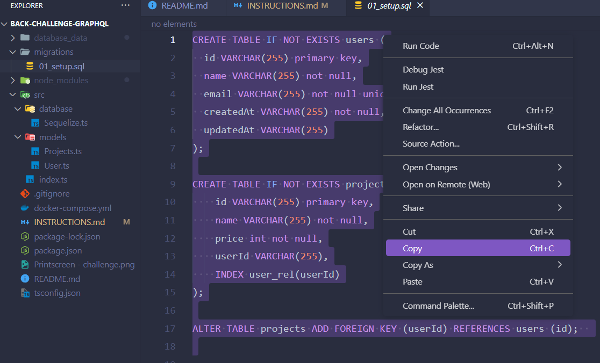
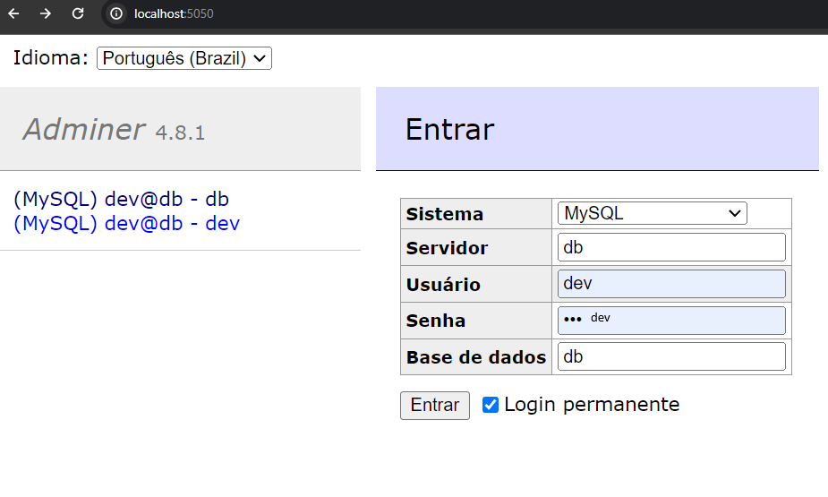
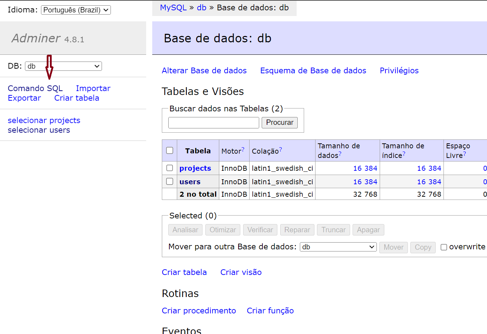
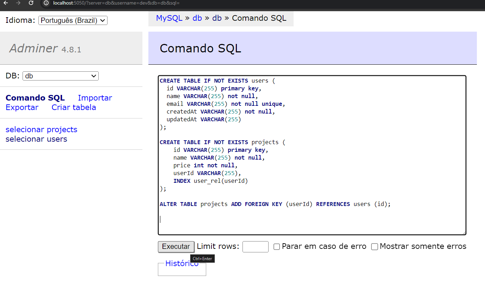

## **Prerequisites**

Before you get started, make sure you have the following software installed on your machine:

- [Node.js](https://nodejs.org/) (v14 or higher)
- [NPM](https://www.npmjs.com/) or [Yarn](https://yarnpkg.com/) package manager
- [Docker](https://docs.docker.com/engine/install/)

# Running the project.

First, you must have to have a mongo image running. I use to use docker to help me with it. So, I recommend you to also use docker.
The first thing you should do is exec the following command:

    docker-compose up -d

Then, check whether the mongo image is running with the command:

    docker ps

After do that. You must have to install the dependencies with the command:

    npm install
    // or yarn


# Adicionar esquema SQL no Adminer

Com o projeto rodando você agora deve configurar os esquemas SQL no Adminer:
# 1. Copie o esquema de tabelas do projeto


# 2. Com o projeto rodando, entre na porta [localhost:5050](https://localhost:5050) e autentique-se com as credenciais demonstradas na imagem
  Servidor: db
  Usuário: dev
  Senha: dev
  Base de Dados: db


# 3. Cole o esquema no Comando SQL




# Feito! Agora rode o projeto.
Then, just start the API with the command:

   ``` npm run dev
    // or yarn dev
    ```

### Queries Examples

#### Users: List all users
<details><summary>Query Details</summary>

<p>
  
```graphql
query buscarUsuario {
  users {
    id
    name
    email
  }
}
```

</p>
</details>

#### Projects: List all projects
<details><summary>Query Details</summary>

<p>
  
```graphql
query buscarProjetos {
  projects {
    id
    name
    price
    User {
      id
      name
      email
      createdAt
      updatedAt
    }
  }
}
```

</p>
</details>


### Mutations Examples
#### CreateUser: create a user
<details><summary>Mutation Details</summary>

<p>
  
```graphql
mutation CriarUsuario {
  createUser(name: "John Doe", email: "jhondoe@gmail.com") {
    id
    email
    name
  }
}
```

</p>
</details>

#### CreateProject: create a project
<details><summary>Mutation Details</summary>

<p>
  
```graphql
mutation criarProjetos {
  createProject(
    name: "Projeto 1"
    price: 1000
    userId: "id do novo usuário"
  ) {
    id
    name
    price
    User {
      id
      name
      email
      createdAt
      updatedAt
    }
  }
}
```

</p>
</details>
